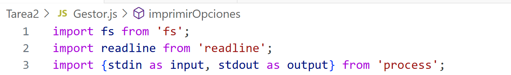
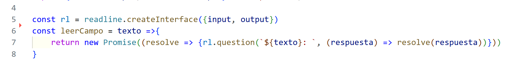
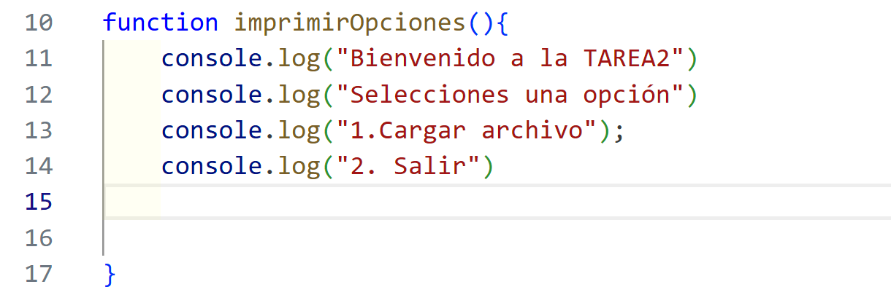
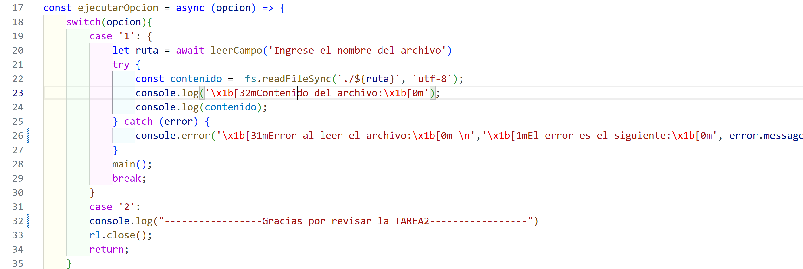
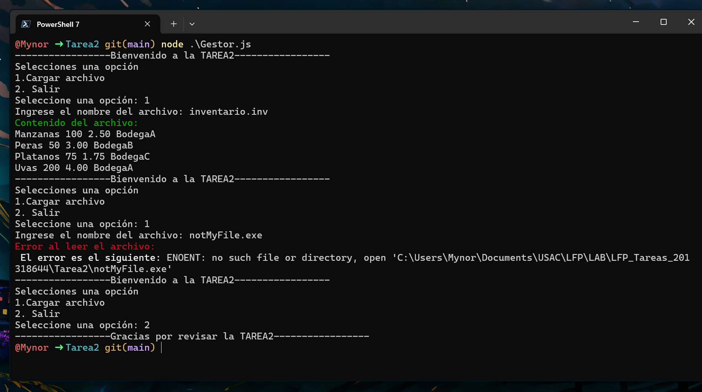

# Manejo de Archivos
La lectura de archivos es una de las operaciones fundamentales en la programación ya que permite a las aplicaciones acceder, procesar y analizar información almacenada de forma externa. 

Módulos y Métodos utilizados: 
* ```fs``` (File System)
* ```readline``` (Entrada interactiva)
* ```readFileSync```
* ```readFile```
* ```createReadStream```

## Especificaciones
* Se utiliza el módulo ```fs``` para operaciones de archivos

* Se utiliza el módulo ```readline``` para crear el menú interactivo

* Se manejan excepciones con ```try``` - ```catch```

* Cuando no encuentra el archivo se muestra el mensaje de error __No se encuentra el archivo__ el programa no se detiene

* El programa se ejecuta hasta que el usuario selecciona la opción de salir


## Funcionamiento
Se creó un archivo inventario.inv con el siguiente formato: 
NombreProducto | Cantidad | Precio | Unitario Ubicación|

Ejemplo del contenido del archivo: 

```
Manzanas 100 2.50 BodegaA
Peras 50 3.00 BodegaB
Platanos 75 1.75 BodegaC
Uvas 200 4.00 BodegaA
```


Se importaron los módulos para trabajar con archivos además de las referencias estándar de entrada y salida


Se creó la interfaz para la lectura y escritura del archivo además de la promesa que se resuelve con la respuesta del usuario



Se creó la función imprimir con las opciones del menú



Se creó el menú como tal que interactúa con el usuario se crea con `async` para que pueda tener `await` y espere la respuesta del usuario, todo esto dentro del `try-catch` para capturar el error, también se especifica el tipo de error, con diferente color y negrita


Un ejemplo de su funcionalidad, cabe mencionar que el programa no se termina aunque se escriba mal el archivo como se muestra en la captura, únicamente se sale si el usuario así lo decide



Una pequeña demostración de la funcionalidad del programa

